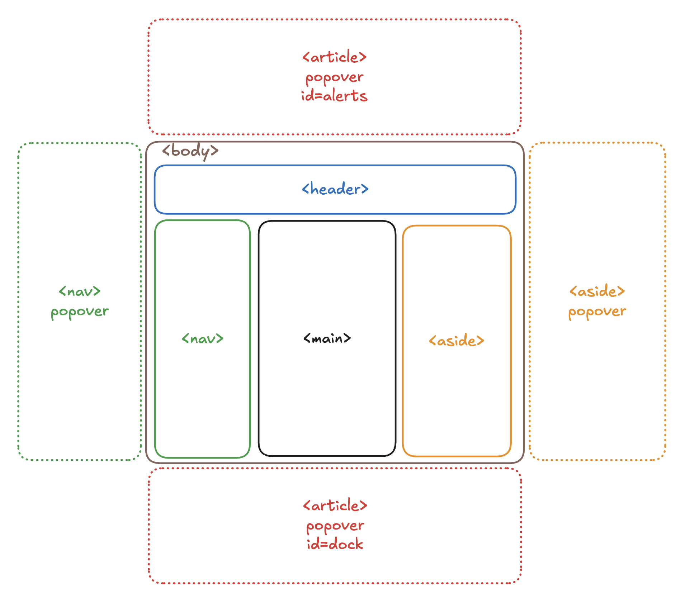

# About
A CSS Design System

## Core Ideas
 - Responsive by default
 - Layered design system with clear boundries (see below)
 - Designed with datastar in mind for frontend reactivitivy
 - No scrolling on body element (and minimal scrolling in general is perfeared)
 - Minimal use of Z-index - Do things via the top layer instead.

## Layers

Everything must fit into one of these layers

```css
@layer css_1_reset;      /* Browser normalization */
@layer css_2_tokens;     /* All design tokens (colors, spacing, etc)(theme-agnostic) */
@layer css_3_themes;     /* Theme variations for easy swapping */
@layer css_4_base;       /* Element defaults (html, body, h1, etc) */
@layer css_5_layout;     /* Composition primitives (grid, flex, flow) */
@layer css_6_utilities;  /* Single-purpose classes (.text-center, .bg-primary) */
@layer css_7_components; /* All components (buttons, cards, forms, nav) */
@layer css_8_exceptions; /* Context overrides */
```

### What Goes Where
```
Is it a browser default? → Reset
Is it a design token? → Tokens
Is it a Theme Specific? → Theme
Is it element styling? → Base
Is it layout/positioning? → Layout
Is it single-purpose? → Utilities
Is it a component? → Components
Is it an override? → Exceptions
```

### Where do the colors belong?
 - Layer 2 - Tokens (ALL color values)
 - Layer 3 - Base (Element defaults)
 - Layer 5 - Utilities (Flexible color classes)
 - Layer 6 - Components (Component-specific colors)

| Use Utilities When | Use Components When |
|-------------------|-------------------|
| Flexible/reusable styling | Essential to component function |
| Multiple variants needed | Color communicates meaning/state |
| User might want to override | Shouldn't be easily overridden |
| Decorative/theme-dependent | Part of component identity |

The 80/20 Rule
  - 80% of colors → Utilities (flexible theming)
  - 20% of colors → Components (semantic meaning)
  - 100% of color values → Tokens

## Layout


## Hat Tip
[open props](https://open-props.style/)
[opui](https://open-props-ui.netlify.app/)
[piccalil](https://piccalil.li/)

## Demo
[Interactive Demo](https://deufel.github.io/blog/)
